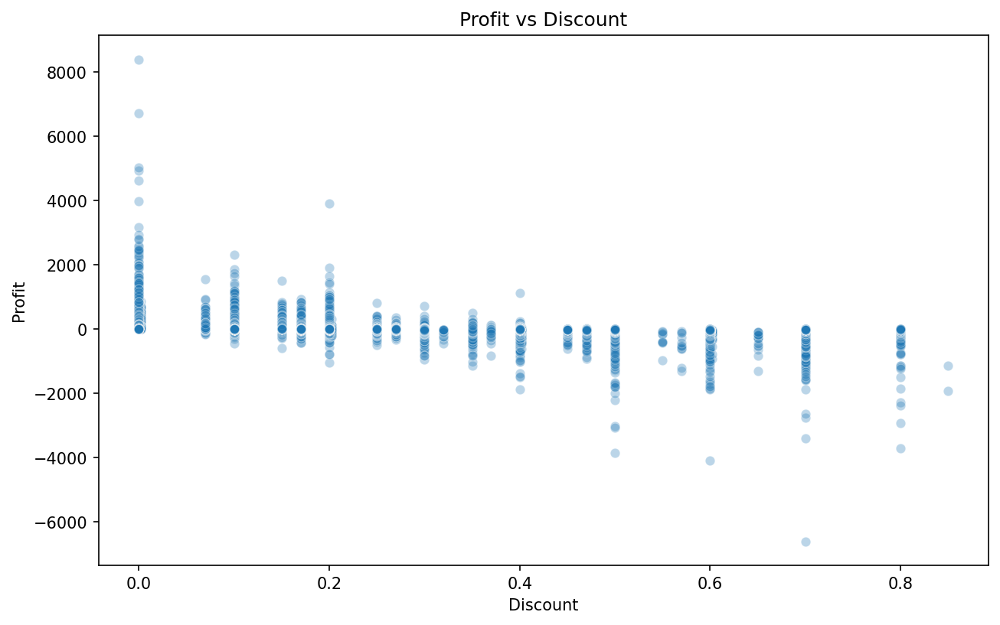
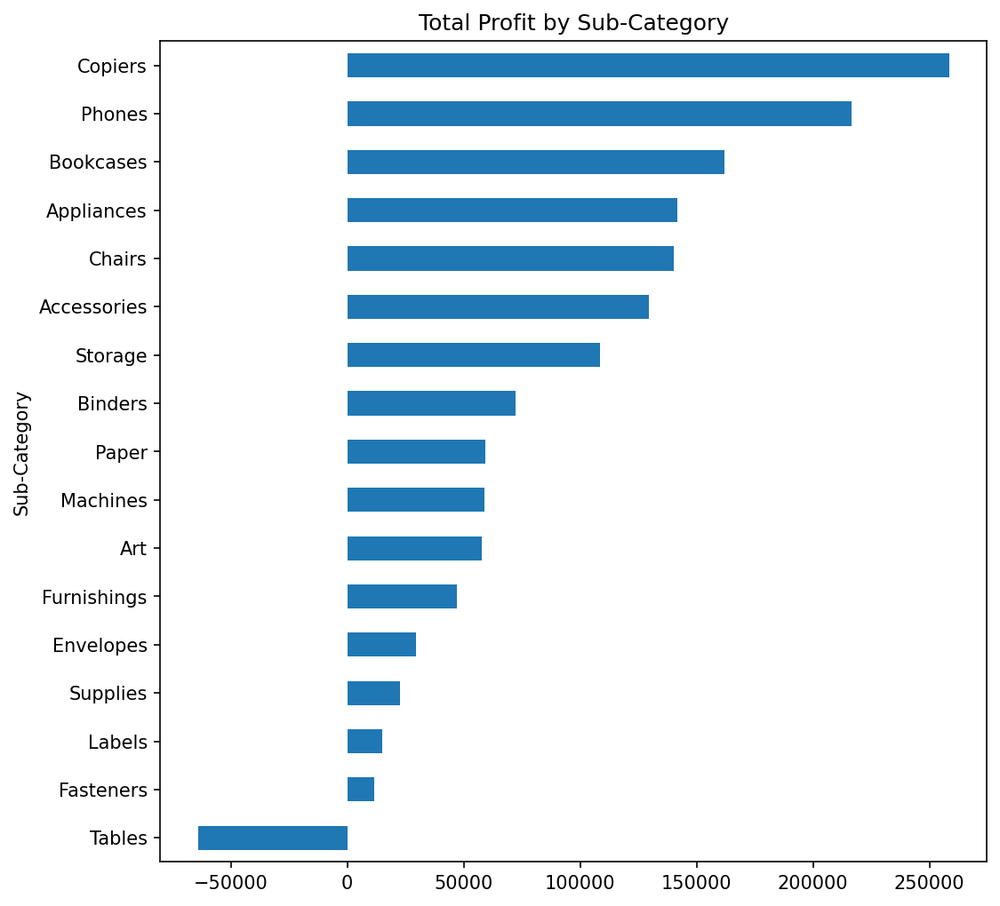
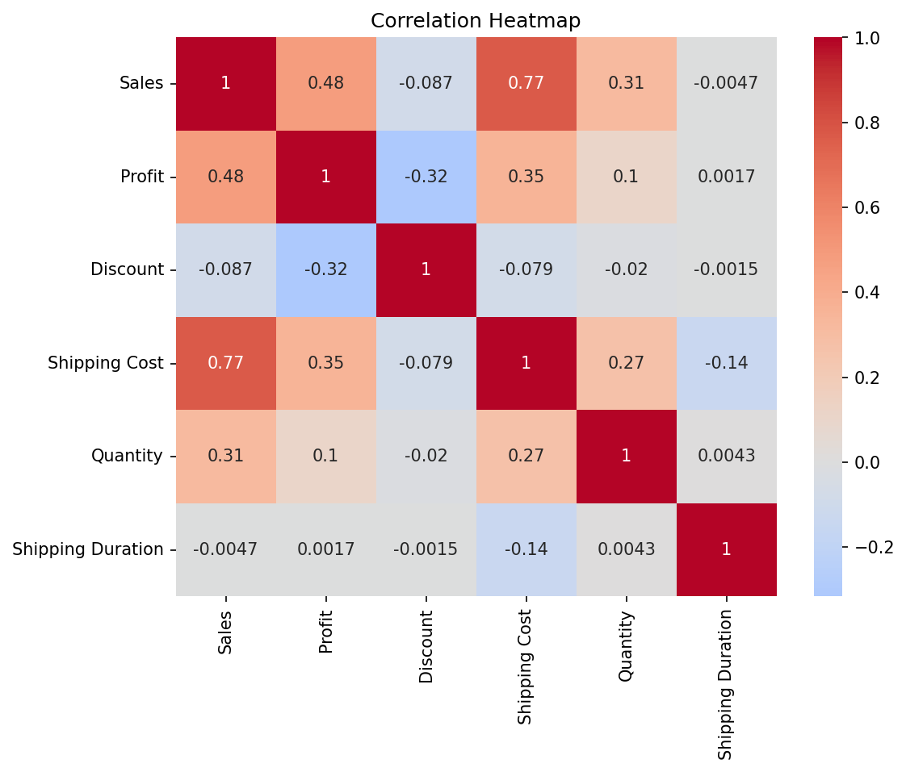
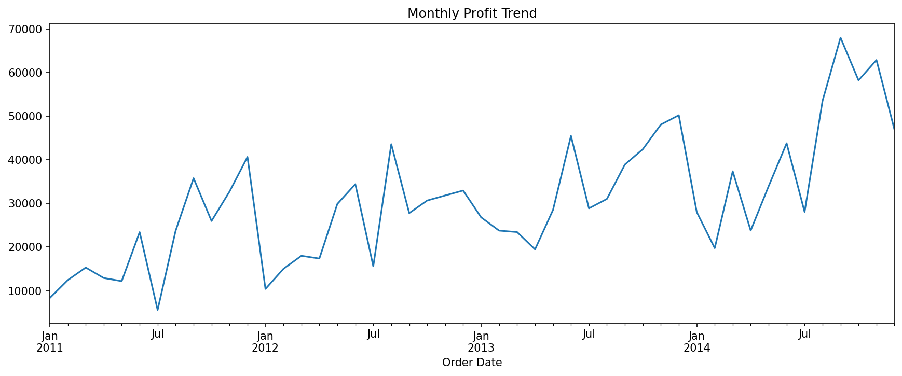

# Global Superstore — Exploratory Data Analysis

Exploratory Data Analysis on the Global Superstore sales dataset, identifying 
the key drivers of profit and loss across products, regions, and discounting 
practices.

## Dataset
Source: Global Superstore Dataset (Kaggle)  
51,290 orders, 24 original features (spanning 2011–2014, across multiple 
global markets).

## Objective
Understand which factors — discounting, product category, region, shipping — 
are most associated with order profitability, and surface findings a business 
could realistically act on.

## Key Findings
1. Discounting is the primary driver of unprofitable orders — profit turns 
   consistently negative past roughly 40–50% discount (correlation: -0.32).
2. Tables is the only sub-category with net negative total profit, driven by 
   a median discount of ~30% (up to 80%).
3. Technology is the most profit-efficient category — it generates more 
   profit than Furniture despite similar total sales.
4. Consumer is by far the strongest segment, contributing more than double 
   the profit of Corporate and nearly triple Home Office.
5. Central, APAC, and EU lead geographically in total profit, while Canada 
   and Southeast Asia lag well behind.
6. Both sales and profit show healthy, seasonal year-over-year growth from 
   2011 to 2014.

## Visuals









## Tech Used
Python, Pandas, NumPy, Matplotlib, Seaborn, Jupyter Notebook

## Project Structure

global-superstore-eda/
├── data/ # raw and cleaned dataset
├── notebooks/ # main EDA notebook
├── images/ # saved plots used in this README
├── requirements.txt
└── README.md

## How to Run
```bash
git clone https://github.com/Shreyashs-dg/global-superstore-eda.git
cd global-superstore-eda
pip install -r requirements.txt
jupyter notebook notebooks/01_eda_global_superstore.ipynb
```

## Limitations
This analysis shows correlation, not causation — the negative Discount-Profit 
relationship is a strong pattern, but the dataset doesn't include cost-of-goods 
data, so discounting can't be fully separated as the cause of losses versus a 
symptom of already low-margin products. Regional/market comparisons are based 
on total profit, not order volume or margin, so they may not reflect per-order 
efficiency. The dataset also only covers 2011–2014.

## Next Steps
Build a regression or anomaly-detection model to predict order-level profit 
(or flag likely loss-making orders in advance) using Discount, Category, 
Sub-Category, Region, and Shipping Cost as key predictors — directly extending 
the discount-driven loss pattern found in Tables.
